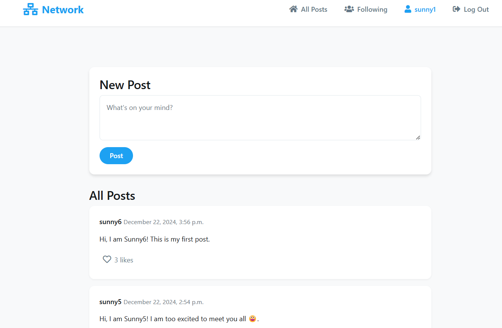
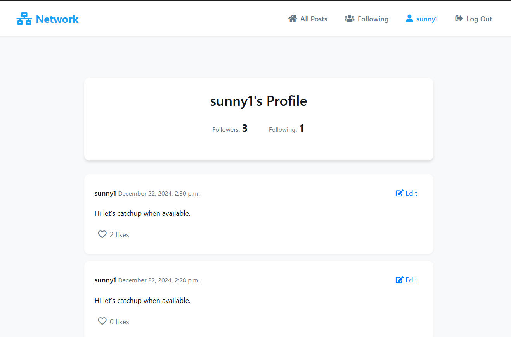
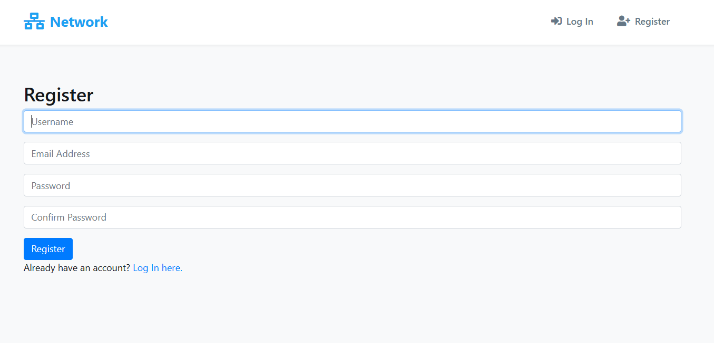

# Social Network Project

## Overview

This is a social network application built with Django, allowing users to register, login, create posts, follow other users, and interact with content through likes. The application features a clean and modern design, providing a seamless user experience.

## App View





## Features

- **User Authentication**: Users can register, log in, and log out.
- **Profile Management**: Each user has a profile page displaying their posts and follower/following counts.
- **Post Creation**: Authenticated users can create new posts.
- **Like/Unlike Posts**: Users can like or unlike posts, with real-time updates.
- **Follow/Unfollow Users**: Users can follow or unfollow other users, with updates reflected on their profile.
- **Pagination**: Posts are paginated for better navigation, allowing users to browse through posts easily.
- **Responsive Design**: The application is designed to be mobile-friendly, ensuring a good user experience on all devices.

## Technologies Used

- **Django**: A high-level Python web framework for rapid development.
- **HTML/CSS**: For structuring and styling the web pages.
- **JavaScript**: For asynchronous operations and dynamic content updates.
- **Bootstrap**: For responsive design and UI components.

## Installation Guide

### Prerequisites

- Python 3.x
- pip (Python package installer)
- Virtualenv (optional but recommended)

### Steps to Run the Application

1. **Clone the Repository**:
   ```bash
   git clone https://github.com/Sunnyio/Network.git
   cd Network
   ```

2. **Create a Virtual Environment** (optional but recommended):
   ```bash
   python -m venv venv
   source venv/bin/activate  # On Windows use `venv\Scripts\activate`
   ```

3. **Install Dependencies**:
   ```bash
   pip install -r requirements.txt
   ```

4. **Apply Migrations**:
   ```bash
   python manage.py migrate
   ```

5. **Create a Superuser** (optional, for accessing the admin panel):
   ```bash
   python manage.py createsuperuser
   ```

6. **Run the Development Server**:
   ```bash
   python manage.py runserver
   ```

7. **Access the Application**:
   Open your web browser and go to `http://127.0.0.1:8000/`.

## Usage

- **Register**: Create a new account by clicking on the "Register" link.
- **Login**: Use your credentials to log in.
- **Create Posts**: After logging in, you can create new posts from the main page.
- **Follow Users**: Navigate to a user's profile and click the "Follow" button to follow them.
- **Like Posts**: Click the heart icon on any post to like or unlike it.
- **View Profiles**: Click on usernames to view their profiles and posts.

## Contributing

Contributions are welcome! If you have suggestions for improvements or new features, feel free to open an issue or submit a pull request.

## License

This project is licensed under the MIT License. See the [LICENSE](LICENSE) file for details.
